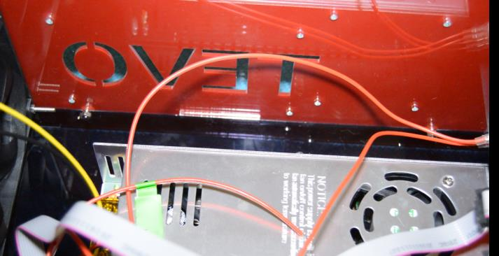
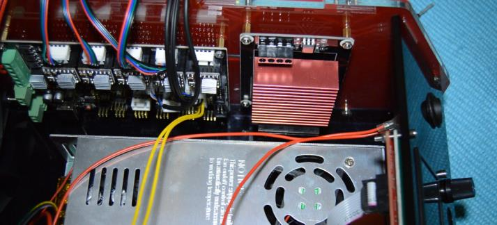

##2.8 External MOSFET Mounting

As of Mar-2017, BW control box has pre-drilled holes for mounting the external MOSFET with the supplied mounting HW, e.g. stand-offs & screws.

Refer to the table below for details.

<table border=1>
  <tbody>
    <tr>
      <td style="text-align:center; width:50%"></td>
      <td style="text-align:left; width:50%">
      <b style="color:green">Control-Box inside view</b>  
      Pre-drilled holes for the external MOSFET on the "TEVO" side acrylic wall.
    </tr>
  </tbody>
</table>

<table border=1>
  <tbody>
    <tr>
      <td style="text-align:center; width:50%"></td>
      <td style="text-align:left; width:50%">
      <b style="color:green">Control-Box inside view</b>  
	External MOSFET mounted on the “TEVO” side acrylic wall.
    </tr>
  </tbody>
</table>