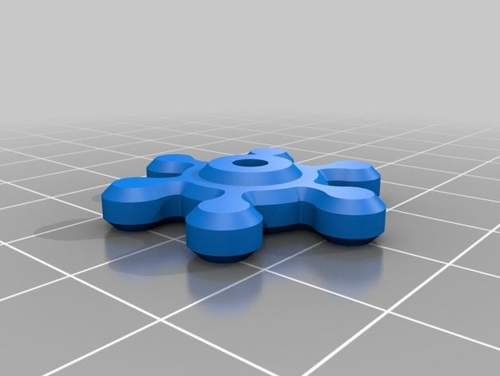

##2.7 Recommended prints to start with
Parts you might like to print to enhance the machine performance at start up.

<table style="width:100%; border: 1px solid black">
  <tr>
    <th colspan="2">Calibration</th>
  </tr>
  <tr>
    <th>Image</th>
    <th>Description</th>
  </tr>
  <tr>
    <td rowspan="2">
    <td>20mm XYZ Calibration Cube</td>
  </tr>
  <tr>
    <td>20 mm XYZ calibration cube for checking the calibration and extrusion 
    <a href="http://www.thingiverse.com/thing:214260">http://www.thingiverse.com/thing:214260</a>
    </td>
  </tr>
</table>
<table style="width:100%; border: 1px solid black">
  <tr>
    <th colspan="2">Heatbed</th>
  </tr>
  <tr>
    <th>Image</th>
    <th>Description</th>
  </tr>
  <tr>
    <td rowspan="2">
    <td>Thumbwheels</td>
  </tr>
  <tr>
    <td>Print them in XY scale 1.05 enlarged so the 3 mm nut can be pressed in more easily. 
    Four 3 mm regular nuts need to be purchased. 
    <a href="http://www.thingiverse.com/thing:1571664">http://www.thingiverse.com/thing:1571664</a>
    </td>
  </tr>
  <tr>
    <td rowspan="2">
    <td>Bed Bushings</td>
  </tr>
  <tr>
    <td>Bed bushings to capture the springs can be found here. 
    <a href="http://www.thingiverse.com/thing:1994198">http://www.thingiverse.com/thing:1994198</a> 
    They also prevent the spring to carve into the bed electronic resistance tracks.  
    Needs four M3 nuts for upper bushings. Lower bushings do not need M3 nuts. Four 3 mm regular nuts need to be purchased.
    </td>
  </tr>
</table>

<table style="width:100%; border: 1px solid black">
  <tr>
    <th colspan="2">Mechanical</th>
  </tr>
  <tr>
    <th>Image</th>
    <th>Description</th>
  </tr>
  <tr>
    <td rowspan="2">
    <td>Internal Corner Brackets</td>
  </tr>
  <tr>
    <td>Replacement of stock L-Bracket 
    <a href="http://www.thingiverse.com/thing:1764563">http://www.thingiverse.com/thing:1764563</a>
    </td>
  </tr>
  <tr>
    <td rowspan="2">
    <td>Outsider Corner Brackets</td>
  </tr>
  <tr>
    <td>Extra support for z axis frame's corner brackets 
    <a href="http://www.thingiverse.com/thing:1706643">http://www.thingiverse.com/thing:1706643</a>
    </td>
  </tr>
</table>